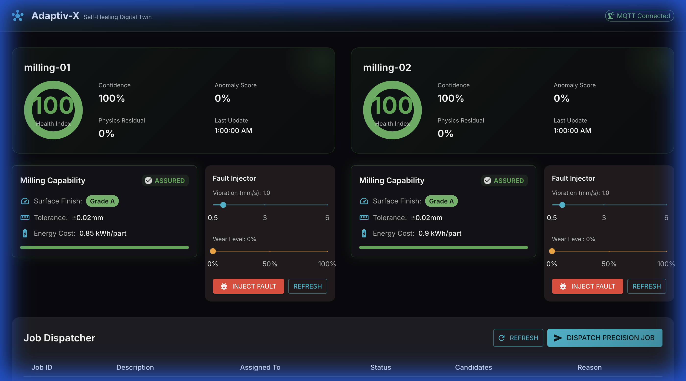
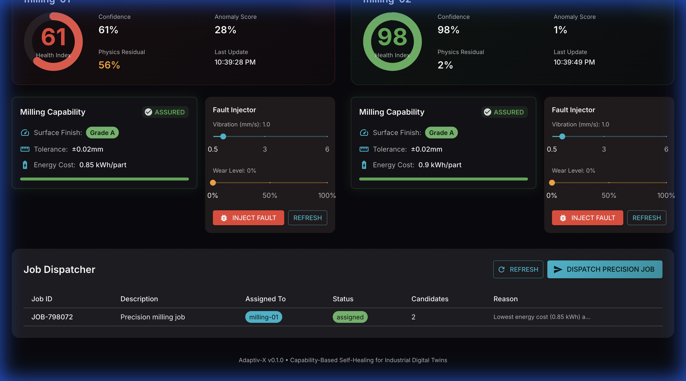
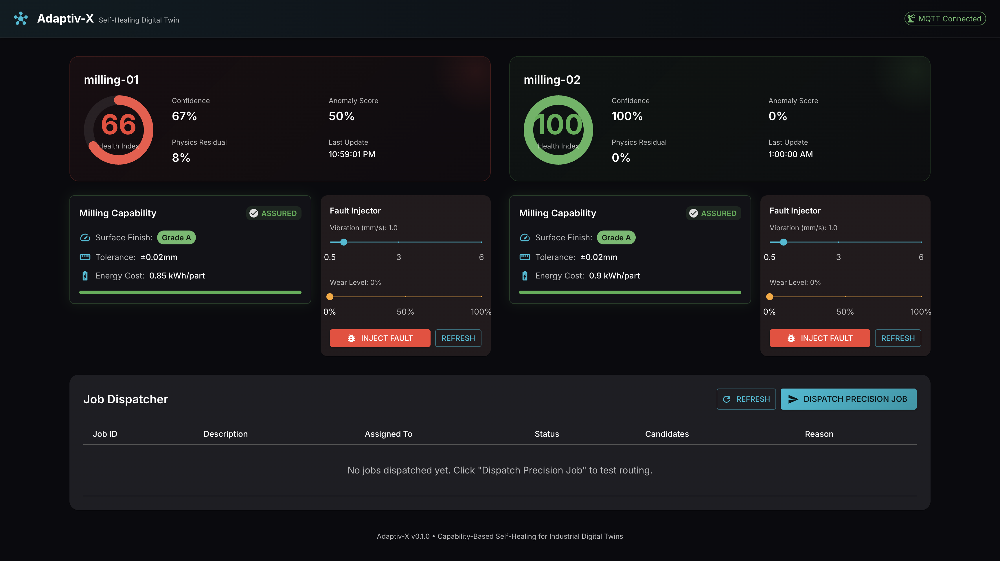
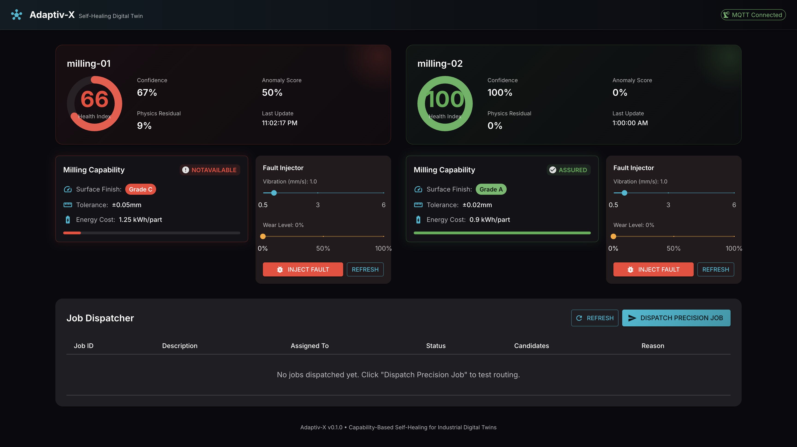
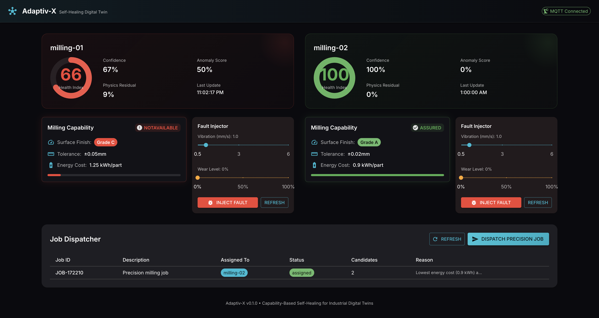

# Adaptiv-X

**Capability-Based Self-Healing for Industrial Digital Twins**

Adaptiv-X is a deployment-ready reference implementation of a "cognitive" Industrial Digital Twin that actively renegotiates its own skills at runtime based on continuously re-evaluated health and feasibility.

> **Disclaimer:** Independent reference implementation. Not affiliated with Manufacturing-X, Catena-X, IDTA, or any "-X alliance" initiative. The name "Adaptiv-X" is used independently and may exist in other unrelated contexts.

## Core Differentiator

This implementation treats the Asset Administration Shell (AAS) not as a passive database, but as an **active semantic control loop**:

1. **Hybrid Detection** (Data + Physics): ML detects anomalies in vibration, then an FMU simulation validates whether the anomaly is plausible wear or sensor noise.
2. **Semantic Reasoning**: The twin updates Capability descriptions (assurance state, quality level, energy cost) in its AAS representation.
3. **Capability-Based Dispatch**: A production broker queries for "assured capability" and automatically reroutes jobs when capability degrades.

## Architecture

```
┌─────────────────────────────────────────────────────────────────────┐
│                        Adaptiv-X Runtime                            │
├─────────────────────────────────────────────────────────────────────┤
│                                                                     │
│  ┌──────────────┐    ┌──────────────┐    ┌──────────────────────┐  │
│  │   adaptiv-   │───▶│    skill-    │───▶│   job-dispatcher     │  │
│  │   monitor    │    │    broker    │    │   (VDI/VDE 2193)     │  │
│  │              │    │              │    │                      │  │
│  │  • ML Model  │    │  • Policy    │    │  • Capability Query  │  │
│  │  • FMU Sim   │    │  • Patcher   │    │  • Bidding Process   │  │
│  │  • Health    │    │  • Audit     │    │  • Contract Award    │  │
│  └──────┬───────┘    └──────┬───────┘    └──────────┬───────────┘  │
│         │                   │                       │              │
│         ▼                   ▼                       ▼              │
│  ┌─────────────────────────────────────────────────────────────┐   │
│  │                    BaSyx AAS Environment v2                 │   │
│  │  ┌─────────────┐  ┌─────────────┐  ┌──────────────────────┐ │   │
│  │  │   Health    │  │ Capability  │  │  SimulationModels    │ │   │
│  │  │  Submodel   │  │  Submodel   │  │     (IDTA 02005)     │ │   │
│  │  └─────────────┘  └─────────────┘  └──────────────────────┘ │   │
│  └─────────────────────────────────────────────────────────────┘   │
│                                                                     │
│  ┌──────────────┐    ┌──────────────┐    ┌──────────────────────┐  │
│  │   Dashboard  │    │    MinIO     │    │     Mosquitto        │  │
│  │  (Redux+MUI) │    │  (FMU Store) │    │     (MQTT Broker)    │  │
│  └──────────────┘    └──────────────┘    └──────────────────────┘  │
│                                                                     │
└─────────────────────────────────────────────────────────────────────┘
```

## The Killer Demo

1. **Start State**: Asset `milling-01` exposes "Assured capability" with Grade A surface finish
2. **Dispatcher** assigns a high-precision job to `milling-01`
3. **Inject Fault**: Simulated bearing wear increases vibration
4. **adaptiv-monitor** detects anomaly, validates via FMU, computes Health Index
5. **skill-broker** downgrades capabilities in AAS (Grade A → not assured)
6. **Dispatcher** queries again and routes precision work to `milling-02` automatically

## Visualized Demo

| Step | What you should see |
| --- | --- |
| 1. Initial state |  |
| 2. Job dispatched to milling-01 |  |
| 3. Fault injected (health drops) |  |
| 4. Capability downgraded |  |
| 5. Job rerouted to milling-02 |  |

This demonstrates **resilience through adaptation** rather than failure through alarms.

## Quick Start

### Prerequisites

- Docker & Docker Compose
- Python 3.11+
- Node.js 20+ (for dashboard)

### Local Development

```bash
# Clone the repository
git clone https://github.com/hadijannat/adaptiv-x.git
cd adaptiv-x

# Start infrastructure (BaSyx, registries, MQTT, MinIO)
./scripts/bootstrap_local.sh

# Seed AAS packages
./scripts/seed_aas.sh

# Run the demo scenario
./scripts/run_demo.sh
```

### Running Services Individually

```bash
# adaptiv-monitor (ML + FMU hybrid detection)
cd services/adaptiv-monitor
poetry install
export ANOMALY_MODEL_PATH=models/anomaly_model.json.example
poetry run uvicorn adaptiv_monitor.main:app --reload --port 8011

# skill-broker (capability reasoning)
cd services/skill-broker
poetry install
poetry run uvicorn skill_broker.main:app --reload --port 8002

# job-dispatcher (VDI/VDE 2193 bidding)
cd services/job-dispatcher
poetry install
poetry run uvicorn job_dispatcher.main:app --reload --port 8003

# fault-injector (orchestrates fault injection + policy evaluation)
cd services/fault-injector
poetry install
poetry run uvicorn fault_injector.main:app --reload --port 8004

# dashboard
cd dashboard
npm install
npm run dev
```

## Ports

| Component | Default port(s) | Notes |
| --- | --- | --- |
| Dashboard | `3000` | Vite dev server |
| adaptiv-monitor | `8011` | Local dev (container listens on `8000`) |
| skill-broker | `8002` | Local dev (container listens on `8000`) |
| job-dispatcher | `8003` | Local dev (container listens on `8000`) |
| fault-injector | `8004` | Local dev (container listens on `8000`) |
| AAS Environment | `4001` | BaSyx repository |
| AAS Registry | `4000` | AAS descriptors |
| Submodel Registry | `4002` | Submodel descriptors |
| Mosquitto MQTT | `1883` | TCP |
| Mosquitto WebSockets | `9883` | MQTT over WS |
| MinIO S3 | `9000` | Docker Compose default |
| MinIO Console | `9001` | Docker Compose default |

If ports are already in use, Docker may remap host ports (check `docker ps`).

## Standards & Compliance

| Standard | Usage |
|----------|-------|
| **AAS Part 1** | Asset Administration Shell metamodel |
| **AAS Part 2** | API operations (GET, PATCH Submodel elements) |
| **AAS Part 5** | AASX package format |
| **IDTA 02005** | Simulation Models submodel template |
| **FMI 2.0** | Functional Mock-up Interface for physics models |
| **VDI/VDE 2193** | Bidding process for capability negotiation (inspired) |
| **ECLASS/IEC 61360** | Semantic property definitions via IRDI |

## Project Structure

```
adaptiv-x/
├── aas/                          # AAS artifacts
│   ├── packages/                 # AAS JSON/AASX packages (milling-01, milling-02)
│   ├── submodels/               # Submodel templates
│   │   ├── health/              # Health monitoring (custom draft)
│   │   ├── capability/          # Capability description (custom draft)
│   │   └── simulation-models/   # IDTA 02005 instance
│   └── concept-descriptions/    # ECLASS IRDI references
├── fmu/                         # FMU artifacts
│   ├── modelica/                # Modelica source (BearingWear.mo)
│   ├── export/                  # Pre-compiled FMU binary
│   └── scripts/                 # Export scripts
├── services/                    # Microservices
│   ├── adaptiv-monitor/         # Hybrid AI health monitoring
│   ├── skill-broker/            # Semantic capability reasoning
│   ├── job-dispatcher/          # Production routing + bidding
│   └── fault-injector/          # Demo fault injection
├── dashboard/                   # React + Redux + MUI
├── deploy/                      # Deployment artifacts
│   ├── compose/                 # Docker Compose (local dev)
│   └── k8s/                     # Kubernetes Helm charts
├── docs/                        # Documentation
└── scripts/                     # Automation scripts
```

## Submodel Overview

### Health Submodel (Custom Draft)

Continuously updated by `adaptiv-monitor`:

- `HealthIndex` (0-100): Overall asset health
- `HealthConfidence` (0-1): Fusion confidence
- `AnomalyScore` (0-1): ML-detected anomaly level
- `PhysicsResidual` (0-1): FMU simulation deviation
- `LastUpdate`: Timestamp of last assessment

### Capability Submodel (Custom Draft)

Managed by `skill-broker`:

- `ProcessCapability:Milling`
  - `SurfaceFinishGrade`: A, B, or C
  - `ToleranceClass`: Precision specification
  - `AssuranceState`: assured | offered | notAvailable
  - `EnergyCostPerPart_kWh`: Dynamic energy cost
  - `Evidence`: Links to Health and SimulationModels

### SimulationModels Submodel (IDTA 02005)

Standard-compliant FMU reference:

- `ModelFileVersion` → `DigitalFile`: URL to FMU in MinIO

## Contributing

See [CONTRIBUTING.md](CONTRIBUTING.md) for guidelines.

## Security

See [SECURITY.md](SECURITY.md) for vulnerability reporting.

## License

Apache License 2.0 - See [LICENSE](LICENSE) for details.

## Citation

If you use Adaptiv-X in research, please cite:

```bibtex
@software{adaptivx2026,
  title = {Adaptiv-X: Capability-Based Self-Healing for Industrial Digital Twins},
  year = {2026},
  url = {https://github.com/hadijannat/adaptiv-x}
}
```

## Acknowledgments

This implementation builds on concepts from:
- Eclipse BaSyx project
- IDTA submodel templates
- German capability-based engineering discourse
- VDI/VDE 2193 interaction protocols
